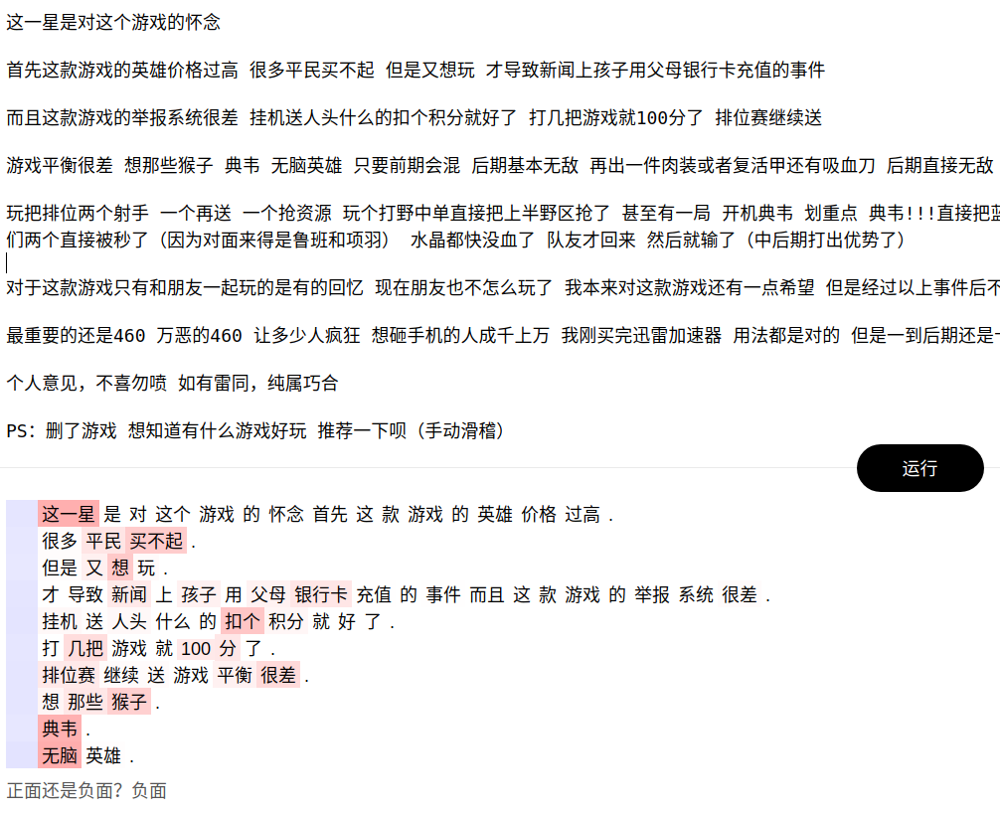

# TapTapCommentsPipeline

**结构**：
```
 -- `cache` //存放中间缓存文件。做完全套占空间其实还挺多的，扒下来60MB的数据楞有5个G的缓存
 -- `data` //合并单个文件之后得到的所有评论。大概有18万条。
 -- `playground` //由于比较菜很多步骤是在 Notebook 边实验边写的，包括合并数据啊简单统计啊之类的。还有作图
 -- `spider` //爬虫代码。跟上一个项目一样
 -- `vis_app` //可视化部分的功能代码
 -- `vis_utils` //可视化需要的中间过程
 -- `pipe*.ipynb` //该系列是三个任务的执行过程：五分评级分类——classifier5，正负向情感分类——PosAndNeg，以及可视化代码的调试——visualization
 -- `datautils.py` //从 cache 到网络输入的辅助函数
 -- `models.py` //模型存放
 -- `run_app.py` //web 应用的执行文件
```


 
断断续续历时半个月，终于把这个小项目完成了，撒花。
很遗憾地是作为一个初学者几乎没有自己的东西。爬虫是超级简单照着样例写出来的，一点优化都没有；为了节省时间，模型和数据处理的代码都是参考拂柳残生大佬的竞赛代码，训练方面也存在可优化的部分，但时间关系不再拓展了；可视化是参考另一位的英文可视化改的，改中文可是费了一番功夫，最后差点功败垂成了结果在 javascript 代码里发现了玄机——原来是特么中文分词的问题……

拂柳残生大佬的代码：https://github.com/fuliucansheng/360
非常干净易读，对我帮助很大。
可视化参考的代码：https://github.com/minqi/hnatt
也是很简洁的项目——数据转换->模型训练->可视化。可视化原理也不复杂，直接拿 Hierarchical Attention 的中间 activation 做词汇和句子上色。不过做完有点小失望，这东西成本比较高，作为玩具还可以，很难用到实际场景里去。

时间关系，不打算再整理搞成一条龙式的代码了。确实比较乱还望见谅。
简单来说使用顺序是这样的：
`spider` 里的爬虫把数据拿下来，在 playground 里的 Notebook 中简单看一下，全读入，合并，做点简单的统计工作。俩文件是干啥的顾名思义。有一些结论很有趣，放在最后说。
然后是外面的三个 Notebook。Classifier5 是把评分当标签，然后根据玩家评论文本预测 Ta 会给游戏多少分。Word2Vec 也是在这里面做的，还有 `cache` 文件的生成。如果想复现，这个 notebook 得放在前面运行；然后是 PosAndNeg，大于3分的划为正类，小于3分的划为负类，做简单的情感分类；visualization 是调试工具，但不能跳过，最后的 web 应用需要的模型是在这里训练生成的。
做完以上工作，你会得到一堆 cache，web 展览需要的是 `./vis_utils/saved_models` 里的 `model` 文件。
运行之后在 `localhost:5000` 打开。可以自由输入一段评论看结果。需要注意的是在模型文件 `hanVis.py` 里我设置了最长10个句子、每句话25个词，超出的部分会自动删去。

**以下是一些简单的讨论：**
 - TapTap 评论读取有限制，五百页以后的不给显示，是网站程序员的锅，所以爬到的数据可能会比网站显示的少很多；另外考虑时效性我把超过半年以前的评论也过滤掉了。
 - 数据集先按照8：2分训练集和测试集，前者再按9：1分出训练集和验证集，最后得到训练集11w条，验证集1.6W，测试集5w条。——咦忽然想起来测试集没怎么用。
 - Word2Vec训练出来只有4W+词汇，可见限定领域时词汇的使用会比较集中；
 - TapTap 排行榜比较迷，热门榜和热玩榜差别并不大，很多新出的作品也会特别靠前，但评论积累却不多。所以在爬虫的时候就把评论低于3k的游戏筛除了。不知道这说明 TapTap 的榜单机制有问题还是手游玩家普遍喜新厌旧……以及考虑到 TapTap （相比之下）是手游方面讨论质量比较高的社区（高端玩家.jpg），风评比较差的游戏基本不会上热门榜，所以样本标签分布非常不均匀，评分均分超过了3.6，刚开始没注意，好在没有过多影响结果。
 - 但也说明如果要做更细致的考察，应该多去爬一些评分较低热门作品。
 - 虽然已经算讨论气氛比较好的社区了，但绝大多数评论仍然不超过五十个字——中位数是47，均值111.2，75%也才到111，但最大达到了1w+，说明那些显示在评论首页的长评将均值一把拉上去了……为了保证样本数，爬虫的下限是15个字，这样看来似乎有提高阈值的必要——但这样就需要爬更多的游戏。
 - 还简单考察了一下用户的机型、各游戏评论的分布情况，可以去 `testAndPlot.ipynb` 里瞧瞧。


**一部分训练结果**：
 - classifier5 的结果不是很理想，最高只有不到60%的准确率。但也比较容易理解——简单来说，你不会没见过“虽然东西很一般但习惯好评”的淘宝用户吧？时间关系，爬下来的数据我没有做任何过滤，所以高分段里有多少垃圾评论还真不好说……
 - 换到正负分类结果就好多了，最高是 86% 左右，去掉了中立的3分评论。不能更进一步的主要原因依然是数据噪声比较多，证据是只要不到三分之一的数据就能达到大概84%的结果，而且我也没做进一步调优。前面提过样本分布不均匀，换成正负情感之后正：负大概是8：3的比例。
 - 我以前自己写的模型不如拂柳残生大佬的模型表现好所以直接用了人家的模型代码。然后在做可视化的时候我又试了一下这位 minqi 的 HAN，比拂柳残生的 HAN 要好一些，主要区别是 minqi 的 HAN 在 Attention 层各加了一个全连接层。不过是不是它造成的还没测试。

